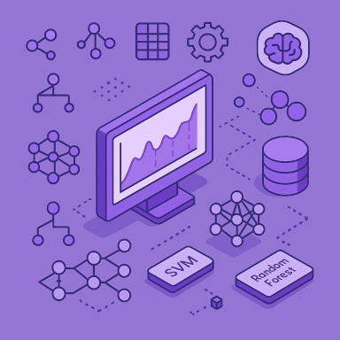

<h1 align="center"><b>Machine Learning</b> </h1>

<h3 align="center">Le Machine Learning, est un domaine de l’intelligence artificielle pemettant aux machines d’apprendre et de faire des prédictions ou des décisions sans être explicitement programmés pour chaque tâche spécifique. Plutôt que de suivre une série d’instructions prédéfinies, ces modèles “apprennent” à partir de données et utilisent des algorithmes pour identifier des patterns et en tirer des conclusions.  
Les phénomènes étudiés peuvent être considérés comme des systèmes qui, en fonction du contexte de leur environnement, présentent un comportement particulier en vue de certains événements.</h3>

<h2><b>Projets</b></h2>

> ### **Apprentissage supervisé**
1. [Prédire le score de dépenses](projects/spendingScore)
2. [Prédire la qualité](projects/wineQuality)
3. [Prédire le courrier iindésirable](projects/spam)
4. [Prédire l'immobiliere à Melbourne](projects/melbourne)
5. [Prédire le prix des maisons](projects/house)
6. [Prédire le prix des logements en Californie](projects/californianHousing)
7. [Prédire les malidies cardiaques](projects/heartDisease)
7. [Prédire la survie dans le Titanic](projects/titanic)
9. [Système de recommandation de films](projects/movies)
10. [Prédire le diabète](projects/diabetes)
11. [Prédire la maladie de Parkinson](projects/parkinson)
12. [Reconnaitre les chiffres manuscrits MNIST](projects/mnist)
13. [Le vaisseau spacial Titanic](projects/spacecraft)
14. [Prédire le prix de l'action Tesla](projects/tesla)
15. [Prédire les performances des étudiants](projects/studentPerformance)
<!--<kbd>_Soon_</kbd>-->
> ### **Apprentissage semi-supervisé**
1. [Netflix](projects/netflix)  
<!-- 2.  -->
> ### **Apprentissage non supervisé**
1. [Partitionner les données d’iris](projects/clusteringOnIrisData)
2. [Partitionner la clientèle d'un centre commercial](projects/clusteringOfCustomersInAShoppingMall)
3. [Analyse et clustering non supervisé 👉 KMeans, DBSCAN et PCA](projects/KMeans-DBSCAN-PCA)
4. [Algorithme Apriori](projects/AI4PredictingHousePrices)
5. [Trouver les anomalies avec la forêt d'isolement](projects/isolationForest)
6. [Modélisation thématique avec LDA (Latent Dirichlet Allocation)](projects/LDAmodeling)
7. [Réduire la dimensionnalité par t-SNE et UMAP](projects/tSneUmap)
8. [Détection d'anomalies 👉 Isolation Forest & Local Outlier Factor (LOF)](projects/anomalyDetectionUsingAnIsolationForestAndTheLocalOutlierFactor)
9. [Estimer de la densité de noyau (KDE)](projects/estimateTheDensityOfTheCore)
10. [Partitionner par le clustering hiérarchique](projects/segmentingCustomersUsingHierarchicalClustering)
11. [Détecter les anomalies avec OneClassSVM](projects/detectingQnomaliesYithOneClassSVM)
12. [Partitionner avec GMM, KMeans & DBSCAN](projects/clusteringGMM_KMeans_DBSCAN)
13. [Associer des règles d’apprentissage avec FP-Growth](projects/fpGrowth)
14. [Partitionnement par un mélange bayésien gaussien](projects/clusteringUsingABayesianGaussianMixtureModel)
15. [Réduire la dimensionnalité par LDA et de SVD](projects/dimensionReductionUsingLDA-SVD)

<h2> 🔗 Disciplines connexes</h2>

<a href="https://github.com/MiKL5/Business_Intelligence/">Business Intelligence</a>  
<a href="https://github.com/MiKL5/DataScience/tree/master/machineLearning/">Data Science</a>  
<a href="https://github.com/MiKL5/Artificial_Intelligence/">Intelligence artificielle</a>  
<!-- [IOT and AIoT](https://github.com/MiKL5/aiot)  -->
<!-- [Robotique](https://github.com/MiKL5/robotics)   -->